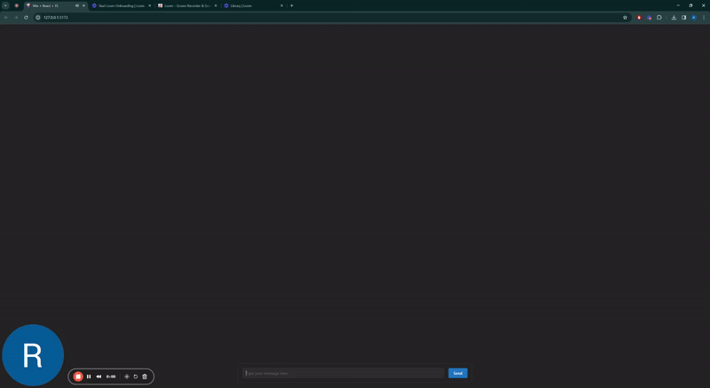
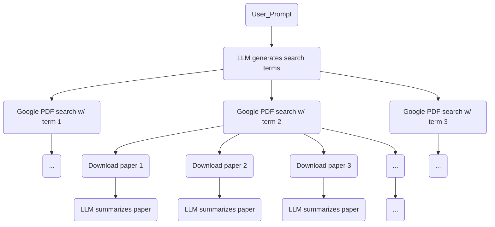

# Researcher Assistant
A simple LLM application to showcase streaming and concurrent processing.

## About the project
* I created this project as a less-than-2-day take-home interview challenge.
* It's not safe to use. It downloads and opens files from random URLs off the internet with wild abandon.

**Project Goals**
* Demonstrate streaming LLM responses via server-sent events.
* Demonstrate concurrent processing of data streams, allowing out-of-order streaming to the frontend.



## Quick start
#### Requirements
* python 3.11
* node 20
* poetry
* an OpenAI API key

#### Set up the backend and run
```bash
$ cd api
$ touch .env && echo "<My OpenAI API key>" > .env
$ poetry install
$ poetry run uvicorn api.app:app --reload --port 5000
```

#### Set up the frontend and run

```bash
$ cd ui
$ npm i
$ npm run dev
```

#### Do some research!
* Query for some research topic
* Google will probably throttle you eventually

## Known Issues

* Very little error handling
* Minimal logging via print statements
* No persistence of anything
* Some frontend error in console complaining about a `<div>` inside a `<p>`
* Extensive use will get you a 429 from google search
* LLM responses can probably be improved to focus on research and not random PDFs
* System is best-effort and won't retry if something fails


## Architecture



#### Notes
* At each step of the process, a `Research` object is yielded to the frontend containing the partial result
* To mitigate race-conditions, each message sent to the frontend is annotated with an auto-incremented order. The frontend only renders the most "recent" (i.e. highest order) `Research` object.

## Notes on the code

* Most of the frontend was generating by ChatGPT with some minor editing
* `routes.py` has the entrypoint for the backend logic
* `researcher.py` contains most of the concurrent processing
* Each call to the backend produces one `Research` object. Asynchronous tasks modify that single object (and children) and repeatedly yield it to the frontend as it gets more and more populated with data.
* That's pretty much it!
